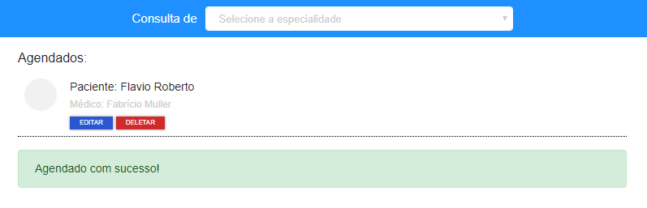

<!-- PROJECT LOGO -->
<br />
<p align="center">
  <a href="https://github.com/othneildrew/Best-README-Template">
    
  </a>

  <h3 align="center">Feegow Challenge</h3>

  <p align="center">
    Esse é um teste focado em design de código, e conhecimento de orientação a objeto.
    <br />
    <a href="https://github.com/feegow/feegow-challenge"><strong>Desafio »</strong></a>
    <br />
  </p>
</p>

## Introdução do problema
A clínica Exemplo precisa exibir a listagem de seus médicos separados por especialidade em seu site para que seus pacientes tenham acesso. Essa clínica utiliza o Feegow que possui toda a api necessária para isso, disponibilizada pela empresa.

## Solução
Foi criado uma solução totalmente alimentada pela API disponibilizada, onde suas operações é no formato de CRUD (Create, Read, Update and Delete).

### Inicio:


### Consulta da especialidade:


### Cadastro:


### Lista dos cadastrados:


## Instalação

### Banco:
A `porta do mysql está como: 3306`, sé sua porta for diferente, tem que muda-la.
```
CREATE DATABSE feegow;

CREATE TABLE `agendarprofissional` (
  `agendarProfissional_id` int(11) NOT NULL primary key auto_increment,
  `specialty_id` int(11) DEFAULT NULL,
  `profissional_id` int(11) DEFAULT NULL,
  `name` varchar(100) DEFAULT NULL,
  `cpf` varchar(11) DEFAULT NULL,
  `source_id` int(11) DEFAULT NULL,
  `birthdate` date DEFAULT NULL,
  `date_time` datetime DEFAULT NULL
);

```
### Código:
No terminal, só digitar a sequencia abaixo, lembrando que a `porta é: 3000`
```
npm install
node app.js ou nodemon app.js
```

## Tecnologias Utilizadas 

* Boostrap
* Jquery
* Ajax
* NodeJs
* Banco MySql
